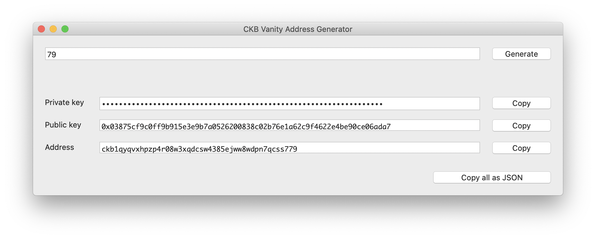

# CKB Vanity Address Generator

Generate a CKB address with specified suffix.

## Requirements

Xcode 11, Swift 5, Swift Package Manager, and fun.

### macOS

```shell
brew install pkg-config
brew install libsodium
```

### Linux (Ubuntu)

~It should be easy to support Linux, but I have to see if I'm not that lazy to do so anytime soon.~

Update: supported, but it's a stupid implementation calling `/usr/bin/openssl` to generate private keys (expect it to be slower).
Please figure out how to set up Swift first.

```shell
apt install libsodium-dev
```

## Usage

```swift
swift build
// Replace `.build/x86_64-apple-macosx/debug/` with the actual build path on your machine.
// 666 is the suffix to look for.
.build/x86_64-apple-macosx/debug/cva 66
```

Output:

```shell
Generating::  .
🎉 Congrats! You've got an awesome address!
{
    "private_key": "0xc567a1e32f48f6700506358fdc420295e3e4f3ffb2048e911588910205700ced",
    "public_key": "0x02570d5d216ed44b14c1e3ceeaacc58c6d4acf71071c4bdd601ebb95023f033ee3",
    "address": "ckt1qyqt4yp7r2z2gf3f5cq66u3fpu6kz0n82xtsxjmc66"
}
```

## macOS App

A macOS app is also available if GUI is preferred. To build, open `macOS.xcodeproj` with Xcode 11 or above and build/run.



## Warning

[CKB address format](https://github.com/nervosnetwork/rfcs/blob/master/rfcs/0021-ckb-address-format/0021-ckb-address-format.md) wraps lock script with Bech32 encoding. All addresses always have the same first 7 characters, thus generating addresses with a prefix you wish to own doesn't make much sense.

This tool generates address with a **suffix** you specify. Practically it should be very easy and fast to generate addresses with a 1-3 character suffix. For longer suffix it might take quite long long long time to finish, due to the fact this is a silly single thread brute force program.

[Bech32](https://github.com/bitcoin/bips/blob/master/bip-0173.mediawiki#bech32) doesn't allow a few alphanumeric characters. Trying to specify "1", "b", "i", or "o" will not work.

## License

This is released under the [MIT License](LICENSE).
